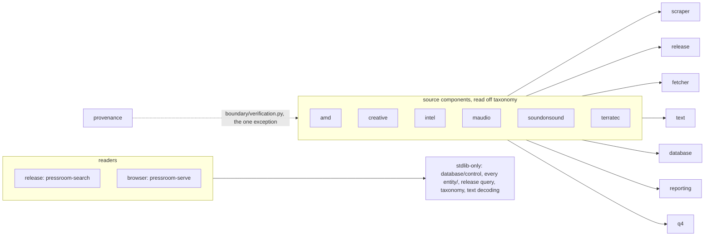

# pressroom

<!-- sbce:generated:start — projection of the specs; do not edit; regenerated from the system doc (pressroom/__init__.py) and each component's __init__.py docstring -->
> Historical company press releases, recovered mostly from dead sites through
> the Wayback Machine into one SQLite database with a full-text index: one
> command per scraper, and two readers - a search CLI and a local browser.

## Capabilities
- **amd** — AMD's investor-relations press releases, on the Q4 platform. · [spec](pressroom/amd/__init__.py)
- **browser** — The local, read-only reader for the corpus: a JSON API over `pressroom.db` and the one page that renders it, on this machine only. · [spec](pressroom/browser/__init__.py)
- **converter** — What an attachment's bytes are, and which converter reads them. · [spec](pressroom/converter/__init__.py)
- **creative** — Creative Technology, over two channels: its own press room and GlobeNewswire. · [spec](pressroom/creative/__init__.py)
- **database** — The one SQLite file: how it is opened, and in what order its tables are made. · [spec](pressroom/database/__init__.py)
- **fetcher** — The fetched bytes, cached, and what asking for them cost. · [spec](pressroom/fetcher/__init__.py)
- **intel** — Intel's investor-relations press releases, on the Q4 platform. · [spec](pressroom/intel/__init__.py)
- **maudio** — Midiman, then M-Audio, over five CMS generations and four domains. · [spec](pressroom/maudio/__init__.py)
- **provenance** — Which capture a row's body was actually read out of. · [spec](pressroom/provenance/__init__.py)
- **q4** — The Q4 Inc. investor-relations platform, as Intel and AMD both run it. · [spec](pressroom/q4/__init__.py)
- **release** — The corpus: what a recovered press release is, how it is written and searched. · [spec](pressroom/release/__init__.py)
- **reporting** — What a run did, in a vocabulary that is the same for every source. · [spec](pressroom/reporting/__init__.py)
- **scraper** — What every scraper is, independent of which: the structure of a run. · [spec](pressroom/scraper/__init__.py)
- **soundonsound** — Sound on Sound - a magazine, not a press room. · [spec](pressroom/soundonsound/__init__.py)
- **taxonomy** — The second axis: which source tags are one firm. · [spec](pressroom/taxonomy/__init__.py)
- **terratec** — TerraTec, over four generations of press site. · [spec](pressroom/terratec/__init__.py)
- **text** — Bytes and markup in, a release's text and its small HTML subset out. · [spec](pressroom/text/__init__.py)

## Components
<!-- projection of the system doc's ## Components wiring; nodes are components, edges the declared direction; never inferred from code -->

<!-- sbce:generated:end -->

## Build & run

```bash
uv venv && uv pip install -e ".[globenewswire]"      # Python 3.14
pressroom-terratec-portal --limit 5
pressroom-terratec-portal --offline                  # re-extract, no network
pressroom-verify-body-origin                         # read-only checks
pressroom-search "Radium" --source midiman_com_pressdb
pressroom-serve                                      # http://127.0.0.1:8765
.venv/bin/python -m unittest discover -s tests       # the suite
```

- **After a rename or a new boundary, re-run `uv pip install -e ".[globenewswire]"`**
  or the script will not exist — `tests/test_entry_points.py`.
- **`PRESSROOM_DB` points every command at another database**; `pressroom-serve`
  also takes `--db`.
- `pdftotext` (poppler-utils) and `antiword` are shelled out to for attachments.
- `pressroom` is only on the venv's path: `.venv/bin/python`, not bare `python3`.

## Conventions

Standing rules for anyone working in this tree. They are declared here, not
verified, unless a line names the test that holds it. **A rule about one
component leaves this section the day it becomes an `Rn.m` in that component's
spec; a rule that spans components and gains a test becomes an `Sn` in the
system doc** — `pressroom/__init__.py`, whose `Sn`, `Dn` and vocabulary this
section refers to by id rather than repeating. The reasoning — what was tried,
what it cost, which measurement decided it — is in `docs/adr/`, one file per
area, indexed in `docs/adr/README.md`. **Read the `docs/adr/` file for an area
before changing anything in that area.**

### Where the rules are

Six places, one job each:

- **`pressroom/__init__.py`, the system doc** — the components' wiring, the
  system invariants `Sn`, the vocabulary, and the decisions `Dn` that span
  components.
- **a component's `__init__.py` docstring, its spec** (D1) — Markdown in the
  `/sbce` form: the one-line responsibility, `## Boundary`, `## Requirements` as
  EARS statements under stable `Rn.m` ids, `## Decisions`, `## Out of scope`. A
  test or a check carries the id of the statement it holds. `browser/__init__.py`
  is the first written out; the others still carry their one-liner.
- **this section** — the standing rules, in the imperative, with one clause of
  why and a pointer.
- **`docs/adr/`** — the reasoning and the evidence, one file per area.
- **a module docstring** — what markup one scraper actually meets; that record
  stays in the parser's docstring. **`docs/layout.md`** — the map, which file
  inside a component owns which job.
- **`checks.md`** — the rendered page's tests, one labelled line per observation
  a browser can contradict, each carrying the id of the requirement it checks
  in the browser's spec.

`CLAUDE.md` is none of these: it is the agent's file, and it imports the system
doc and this README so that both are in an agent's context.

**A measurement goes in a test or a verify pass, never into prose** — not here
and not in `docs/adr/`. A row count in any of these files is the mistake —
`docs/adr/numbers.md`.

### Layout

The tree is `pressroom/<business component>/<boundary|control|entity>/`; what
the layers are, who may call whom and what the words mean is the system doc's
`## Components` and `## Ubiquitous language`.

Adding shared logic means a **new component named for its concern**, never a
module of unrelated helpers (`common.py` was split for exactly this reason, and
`db.py` after it). **Which component owns which job is `docs/layout.md`**, a
lookup `tests/test_layout_map.py` checks against the tree.

**A parser takes bytes and never fetches them** — a crawler may call the
fetcher for its listings. **Prose that says "source" for the middle size is the
smell, and so is a `fetch_*` inside a parser.** No test yet.

**A scraper splits the same way every time**: the crawler and the parser go in
`control/<generation>.py`, whose docstring records what that generation's markup
actually does; the command line in `boundary/<generation>.py`, whose docstring
is the `--help` summary and the usage examples. The module name is the **CMS
generation**, not the domain, because that is what a source tag identifies (D4):
`terratec/control/pressemit.py` is not called `terratec.py` and
`maudio/control/golive.py` is not called `midiman.py`.

**`boundary/command.py` is where every command line is built**: a
boundary declares its per-scraper options as values, an `Option`'s `dest` is the
keyword the crawl receives, and `run()` takes the docstring **whole**, never
`splitlines()[0]`.

**A scraper's command is the only thing anyone runs.** It owns discovery *and*
the catch-up over everything an earlier run could not get, and a rerun picks up
exactly what the last one missed. `--offline` makes no network request (S3);
`--force` re-extracts every row after a parser change and asks first;
`--refetch`, on a live source, fetches every article again and asks first too;
`--retext` re-derives text after a renderer change; `--seed-cache` fetches
captures and parses nothing.

**There is no `backfill_`, `repair_` or `migrate_` family, and there are no
schema migrations** — D2. Reintroducing either is the smell.

**The read-only passes are a third kind of boundary, next to a scraper and a
reader, and they write nothing, ever.** `pressroom-verify-*` re-checks a claim
after anything that could break it; `pressroom-calibrate-*` prints metrics
**and** a page of full texts. Which pass checks what is `docs/layout.md`. No
test yet.

→ `docs/adr/layout-and-naming.md`

### The index and the write — breaking these fails silently

1. **`fts5(title, body)` column order must not change.**
   `release/control/query.py` calls `snippet(releases_fts, 1, ...)`; the `1` is
   a *positional* ordinal. Swap the columns in `release/entity/schema.py` and it
   starts snippeting titles with no error.
2. **All three FTS triggers must exist** (`releases_ai`/`au`/`ad`), and updates
   and deletes must use the external-content `'delete'` command form with the
   OLD values. **`integrity-check` passing is not evidence of a correct index** —
   it checks internal consistency, not agreement with `releases`. Verify with
   orphan/missing counts and token probes instead.
3. **A bulk change to `releases` made outside the triggers is followed
   immediately by `index.rebuild_fts()`, before anything updates a row** — on a
   stale row `releases_au`'s `'delete'` subtracts postings the index never had,
   and the next update corrupts it rather than merely leaving it wrong.
4. **A write that has two statements commits through `with conn:`, never a bare
   `conn.commit()`** — it rolls back on an exception, and a bare commit cannot
   (`tests/release/test_storage.py`). Wherever a body write and an
   `origin.record`/`origin.clear` occur together, they are one transaction and
   both take `commit=False` (S9). Otherwise **commit per row** unless a loop
   batches explicitly (`commit=False`): a crawl has to be resumable at any row.
   Per-row commit has no test yet.

The dedup key and the gated counters are S5; the reader's read-only connection
is S4.

→ `release/entity/schema.py`, `release/control/index.py`,
`docs/adr/browser-panel.md`

### Reporting

**Report progress through `outcome.Stats`** — no per-script counters or marker
chars. The seven outcomes are fixed so a marker stream is readable without
knowing which script produced it. No test and no ADR yet.

### grade and detail_id

- `grade` is `full` | `teaser` | `stub`; `detail_id` is an **opaque reference**.
  **Nothing parses `detail_id`** — asking is `address.is_timestamp()`'s job, and
  only the archive-facing code asks.
- **Use `stored_grade()`, not `already_stored()`**, whenever a row might be
  upgraded later. `already_stored()` is right only for "have I seen this url".
- **An upgrade that replaces a teaser body with the real article must pass
  `grade="full"`** — `GradeVerdictTest` in `tests/test_mirrored_rules.py`.
- **`length(body)` is still the check**: `full` states only what the scraper
  could tell.

→ `docs/adr/grade-and-detail-id.md`

### Sources, tags and the two axes

- **A source tag identifies a scraper — a CMS generation — not a domain, and
  not a language** — D4.
- **One crawler owns one pool of urls, and a tag has exactly one writer.** A
  generation on several hosts can still stamp several tags (`golive`,
  `media_pr` — mirrors, not languages); two commands writing one tag is the
  smell. **Several discovery channels inside one crawler are the normal case**,
  merged into one pool *before* the loop, never fed to it twice. No test yet.
- **A dedup key that was unique per tag is not unique once tags merge.** A
  filename, a CMS `sid`: unique on one host, repeated on its sibling. Whatever
  the key is, it takes the site as its first half (`pressemit.site_of`), or the
  crawl silently reports the second host's copies already-stored.
- **A file read off a sibling domain is not a cross-source claim**, and the
  permission is not automatic either: the host is one of that scraper's own start
  urls, or it is `MIRROR_DOMAINS` and the claim is backed **per row**, after
  `conversion.is_attachment` has checked magic bytes.
- **`twin.py` must never pair across tags** — duplication across tags is
  intended. Inside one tag `twin.fill` needs source + collapsed title + an exact,
  non-empty date, makes **no network request**, and **never deletes or merges**.
  No test yet.
- **`taxonomy/` owns the second axis, source tag → company, and
  `entity/company.py` is an explicit table, never a prefix rule; every source
  needs an entry.** An unmapped source is put in `inne`, which the
  panel answers with **HTTP 400**. No SQL refers to companies.

→ `docs/adr/sources-and-tags.md`, `docs/adr/odd-sources.md`

### The browser's panel

**A view is painted only by the route that is still current** — every loader
carries its route's `AbortController` signal and rechecks `signal.aborted` after
the awaits, because `state` is global and a late response paints the old view
with the new view's filters. **The rules of the panel are the browser's spec
(`browser/__init__.py`), and `checks.md` holds their tests**, one labelled line
each, in the form a browser can contradict; the
frontend keeps `web-static`/`web-conventions` and reports the `[no-js]`
deviation rather than claiming green.

→ `docs/adr/browser-panel.md`

### Encoding

- **Never use `r.text`, and never let BeautifulSoup sniff.** Two correct choices,
  per scraper: `decoding.decode_html(content)` for pages that **claim UTF-8**, and
  `BeautifulSoup(content, from_encoding="cp1252")` for sources known to be
  **wholly pre-UTF-8** (2001-era GoLive, midiman.de) — **never `decode_html`
  there**. No test yet.
- **The repair belongs at the write, not at the decode**, because some damage is
  upstream: `richtext.extract()`, `storage.store_release`/`upgrade_release`.
- **A wrong decode already stored is undone in text, never refetched.**
  `mac-roman` is not a candidate.
- The two detectors agreeing is S7.

→ `docs/adr/encoding.md`

### Text and markup

- **`body` is by definition `to_text(body_html)`** wherever `body_html` exists,
  and **`to_text()` runs on the cleaned HTML, never the source node**. One
  `extract()` call emits both; they must never be derived separately.
- **A change to `clean()` needs the HTML rebuilt** — `--retext` is enough only
  for a change to the renderer.
- **Never write `soup.get_text(" ", strip=True)` for a body.** On a **title** it
  is still right. No test yet.
- **`` is preserved verbatim**, only the scheme filtered.
- **`richtext.cut_from()` must find the text node, not the element.**
- **A parser that finds no container must fall back, never blank**: keep the flat
  text and leave `body_html` NULL.
- **Every parser is DOM-based, and a selector comes from the dominant shape,
  never one sample** — `pressroom-calibrate-containers` is how you get it.
- The allowlist in two places agreeing is S8; the browser's script **rebuilds
  every node rather than trusting `innerHTML`**.
- **A title comes from markup that means "headline", never from the body**, and
  is written **only over an empty one**. **A new extraction rule goes in as a
  fallback, never a replacement**; the walk for a bare-text headline **stops at
  `<p>`**; **the title pass writes the title and nothing else** — a body rewrite
  goes through the gate.

→ `docs/adr/text-and-markup.md`

### Captures

- **Three ways to fetch, chosen by what the page is, and any other way is a
  bug**: an archive capture through `archive.fetch_snapshot()`, cached forever —
  a snapshot never changes; a live site's **article** through
  `politeness.fetch_cached()`, cached, and `--refetch` fetches it again — it can
  change, rarely; a live site's **listing** through `politeness.fetch()`, **never
  cached** — it changes with every release. Every kept byte is stored in
  `page_cache`, so a parser fix costs no refetch.
- **Ask archive.org through `archive._cdx()`** — never `__wb/sparkline` or
  `__wb/calendarcaptures`. No test yet.
- **Query `wayback_calls` before tuning a timeout or a sleep constant.**
- **A live source's `Crawl-delay` is honoured**, through `sleep=...` on both
  live fetches. No test and no ADR yet.
- **A per-item capture is chosen by `archive.fetch_best_matching_snapshot()`,
  never `get_latest_working_snapshot()`** — the newest HTTP-200 capture of a
  dead article url is the rebuilt site's shell page. Captures are scored by the
  **caller's** `score(content) -> int` (0 rejects), which must be the measure
  the write's own gate uses; **an equal score keeps the earlier.**
  **`content is None` with a timestamp still available is a `stub`, not a
  `dead`** — captures exist and none scored; only a `timestamp` of None says the
  archive never saw the url.

→ `docs/adr/captures.md`

### Provenance

- **`body_origin` is the only place a body's capture is written down**, and it is
  its own table so absence keeps meaning "no archive link for this row".
  **The archive link is built from the recorded origin (`address.viewer_url()`),
  never from `detail_id`**, when an entry exists.
- **`origin.record()` goes next to the body write, in the same transaction** —
  S9; a listing collector carries `origin_url` on each entry.
- **`address.is_capture_address()` refuses anything that is not
  `web/<14 digits>id_/…`**, so a Q4 or Drupal id raises at the write site instead
  of storing a dead link.
- **An entry must be dropped the moment it stops being true** — `origin.clear()`,
  as `twin.fill` does.
- **`from_listings` only ever UPDATEs**: a parse matching no stored URL is
  dropped, never inserted, because a row's URL is not always a page that existed.
  A scraper whose releases only ever existed inside a listing **passes a collector
  and no `retry_missing`** — its per-row fetches are guaranteed 404s.
- **`origin_url` never reaches the JSON**; what does is `checks.md`'s
  `[capture-of-listing]` and `[capture-of-own-page]`.
- **Run `pressroom-verify-body-origin` after any pass that touches bodies or
  origins.**

→ `docs/adr/provenance.md`

### The two phases

**`scraper/control/discovery.py` is phase 1 and has three strategies** —
`from_items`, `from_candidates`, `from_teasers`, plus `capture()` for the three
tails that are genuinely per-scraper; **what each one takes is its own
docstring.** A scraper owns everything above the loop — pagination, `no_crawl`,
`limit`, the dedup across captures — and nothing below it.

**Three rules hold inside every one of them**, in one copy:

1. a network error is not a confirmed absence — S6.
2. every counter is gated on the write's return — S5; a write that
   inserted nothing is `skipped`.
3. **a confirmed absence is asked about before an already-stored teaser**, and
   **a bodyless row is never `full`** — `dead` with no row from a live fetch,
   a `stub` carrying no origin from an archived candidate. **A url the archive
   never saw is `dead` unless a listing named it**, and then it is a `stub` of
   that title and date (`from_candidates(stub_if_absent=True)`): the metadata is
   what justifies the row.

**`scraper/control/catch_up.py` is phase 2 and its six strategies are not
interchangeable** — `from_cache`, `from_listings`, `from_live`, `retry_missing`,
`seed_cache`, `retext`; **what each one needs is its own docstring.**
`catch_up()` composes them **free first, network last** (no test yet).

**Three rules hold inside every strategy**, in one copy in the library so a
scraper cannot get them wrong:

1. the cursor is `body_html IS NULL`; `force=True` widens it and says so first.
2. `gate.not_shorter` applies **under** every other gate, `force` included.
3. **the gate is chosen by the address, not by a flag** (`resolution.own_page()`):
   the row's own capture goes through `safe_to_write`, some other page through
   `strict_same_text`, and with a collector such a row is skipped for
   `from_listings`.

**`--seed-cache` comes first when a parser is being redesigned**, and **a
`.pdf`/`.doc` row must never reach an HTML parser** — BeautifulSoup raises
nothing on binary, so `looks_like_html()` checks magic bytes before every parse.
Why the cache first is `docs/adr/catch-up.md`.

→ `docs/adr/catch-up.md`

### The gates

- **Nothing is written without passing a gate in `release/control/gate.py`.**
  `safe_to_write` refuses exactly one thing: text disappearing from the
  **middle** of a body. Two middle-loss cases are allowed **by name**, and
  nothing else is.
- **`edges_only` is what separates correctly dropped chrome from a lost
  paragraph.** `kept`/`clean` cannot — `kept=False, clean=True` is the signature
  of both — so never gate on them alone.
- **A body is compared by word-character *sequence* (`text_delta`), an attachment
  conversion by *multiset* (`gate.wordchars`).** The two are not interchangeable,
  and every conversion allowance stays named and bounded.

→ `docs/adr/gates.md`

### Attachments

- **A PDF gets markup and a `.doc` does not**: `to_richtext()` off
  `pdftotext -bbox-layout`, while **a `.doc` keeps `plain_text()` and `body_html`
  NULL**.
- **Dispatch is on magic bytes, not the extension**, and **CDX's
  `statuscode:200` is necessary but not sufficient** — the capture walk scores
  each capture by how much text it yields, so a non-match is a rejection and a
  thinner early revision scores below the fuller later one.
- **The attachment network crawl is opt-in** (`--attachments`), the one
  exception to "a plain rerun gets everything". No test yet.

→ `docs/adr/attachments.md`

### Working here

- **`.venv/bin/python -m unittest discover -s tests` first, after anything.** Two
  tiers: hermetic, over the gzipped captures in `tests/fixtures/` — no
  `pressroom.db`, no network — and corpus, in `tests/corpus/`, skipped when there
  is no database.
- **`tests/refresh.py --golden` after an intentional parser change**, then read the
  git diff. `--captures` re-picks the fixtures and needs the corpus.
- **`uvx ruff format .` and `uvx ruff check .` before a commit.** Ruff's defaults
  with `select` pinned; `uvx`, never a `dev` extra, so a fresh checkout verifies
  itself with nothing installed.
- **`pressroom-verify-names` after any change that renames or moves a module-level
  name.** It *runs* every import and catches a local shadowing an imported module;
  `F821` owns undefined names — do not add that back. What it cannot check is
  covered by `tests/test_offline_is_offline.py` (a scraper's phase 1 has to be
  *run*) and `tests/test_no_dead_module_references.py` (prose).
- **The tests do not replace the `verify` and `calibrate` passes, or `checks.md`** —
  those print the per-class report you read when a test goes red.
- **Copy the DB before a `'rebuild'` or a bulk update**; neither is reversible.
  `pressroom.db` and `pressroom.db.bak` are gitignored.
- **`tests/` stays outside the package**, so `pressroom-verify-names` sees only the
  package's own modules.
- **Not wanted here: an ORM, a query builder, a row dataclass, schema churn on
  `releases`** — D3.
- **`curl_cffi` is an extra, and the import stays inside
  `globenewswire.make_session()`** — `docs/adr/odd-sources.md`.

→ `docs/adr/working-here.md`, `docs/adr/layout-and-naming.md`
